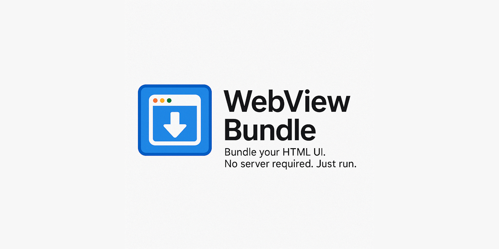

  

    

#### 🚀 Description  
**WebViewBundle** is a lightweight Delphi framework that lets you package HTML, CSS, JavaScript, and assets into a single executable using the WebView2 engine. It works by embedding a ZIP-packed virtual file system directly into your EXE, and serves it using WebView2's virtual host mapping—no server, no installer, no dependencies.  

With WebViewBundle, you can:  
- 💡 Bundle your web app into a standalone EXE  
- 🧰 Embed assets as a compressed ZIP file  
- 🌐 Map virtual URLs (e.g., `app://index.html`) to embedded files  
- 🧩 Display your UI using Edge-powered WebView2  
- 🔒 Avoid runtime extraction or file I/O clutter  

It’s ideal for tools, dashboards, hybrid apps, and offline frontends.

#### 🔧 Key Features  
- 💼 Standalone .exe with embedded resources (will automatically install WebView2 runtime if not found)
- ⚡ Fast and memory-efficient loading from a stream  
- 🧩 Configurable startup page  
- 🌍 Clean separation of UI and logic  
- 🪄 Simple to use in any Delphi app  

> 🚧️ **This repository is currently under construction.**
>  
> WebViewBundle is actively being developed. Features, APIs, and internal structure are subject to change.  
>  
> Contributions, feedback, and issue reports are welcome as the project evolves.

## 🛠️ Support and Resources

- 🐞 **Report issues** via the [Issue Tracker](https://github.com/tinyBigGAMES/WebViewBundle/issues).
- 💬 **Engage in discussions** on the [Forum](https://github.com/tinyBigGAMES/WebViewBundle/discussions) and [Discord](https://discord.gg/tPWjMwK).
- 📚 **Learn more** at [Learn Delphi](https://learndelphi.org).

## 🤝 Contributing  

Contributions to **✨ WebViewBundle** are highly encouraged! 🌟  
- 🐛 **Report Issues:** Submit issues if you encounter bugs or need help.  
- 💡 **Suggest Features:** Share your ideas to make **WebViewBundle** even better.  
- 🔧 **Create Pull Requests:** Help expand the capabilities and robustness of the library.  

Your contributions make a difference! 🙌✨

#### Contributors 👥🤝
 

## 📜 Licensing

**WebViewBundle** is distributed under the **🆓 BSD-3-Clause License**, allowing for redistribution and use in both source and binary forms, with or without modification, under specific conditions.  
See the [📜 LICENSE](https://github.com/tinyBigGAMES/WebViewBundle?tab=BSD-3-Clause-1-ov-file#BSD-3-Clause-1-ov-file) file for more details.

---

🔷 WebViewBundle – HTML in Your EXE, Powered by WebView2

<h5 align="center">
  
Made with ❤️ in Delphi  